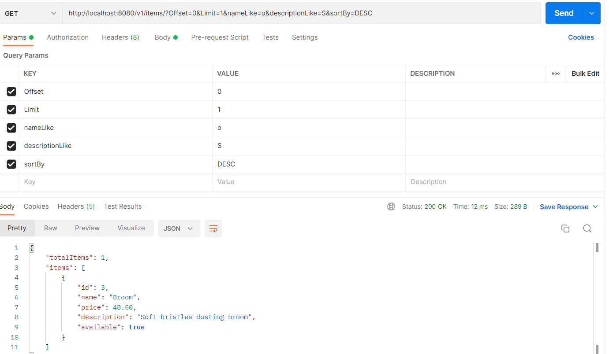
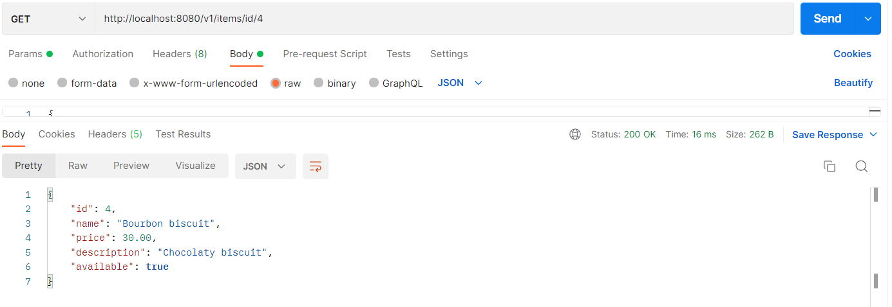
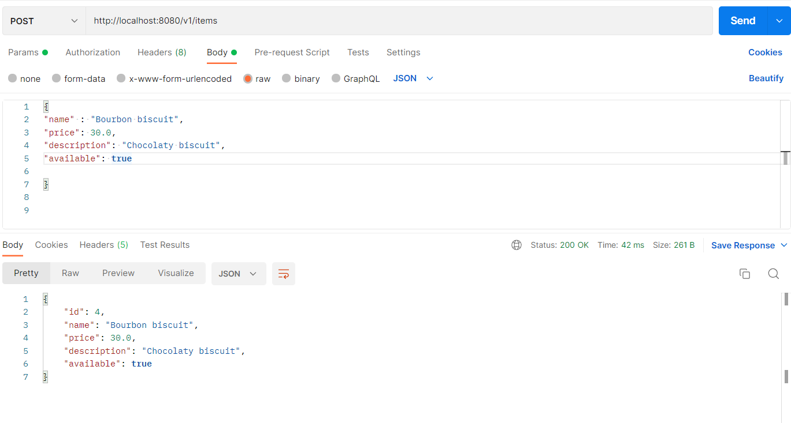
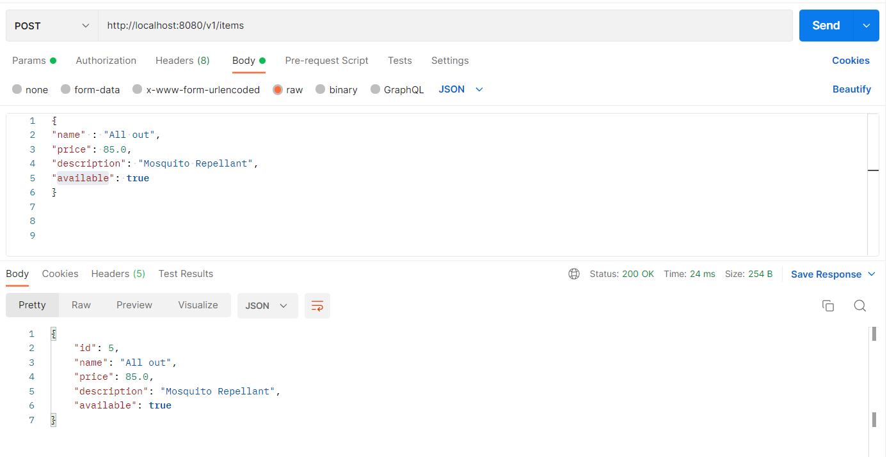
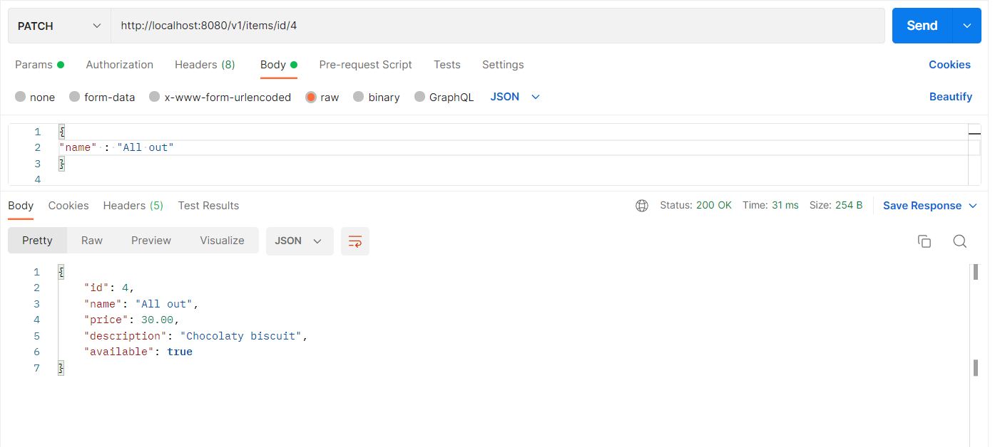
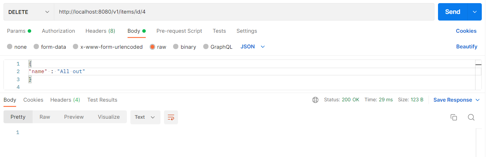

# Project Title : **spring boot project integrated with any SQL based DB**

The project has Five Rest End points according to project Requirement

[project Qusetion Link ](https://docs.google.com/document/d/1tl0IziHrAUIdgLaREzKl8TdcgVHdr3oGBSkXp5GNmSs/edit)

to run the Application One should perform followin task;

Step 1: Run g2g.sql in your Query window provided in sqlfile

Step 2: change the host, username and password in application.properties according to database

Step 3: Run G2gApplication.java with spring boot 

And then run the following command with required host.

1. Get method
   GET `http://localhost:8080/v1/items`
   This method return all the items from database

**If one wants to use query param use accordingly**

`http://localhost:8080/v1/items/id/4?Offset=0&Limit=1&nameLike=o&descriptionLike=S`

All query params are optional

2. GET `http://localhost:8080/v1/items/id/4`
   this method will return specific data associated with id

3. POST  `http://localhost:8080/v1/items`
   this method will genrate new data in database

4. PATCH `http://localhost:8080/v1/items/id/4

   `it will update the filed with associated id

   
5. DELETE `http://localhost:8080/v1/items/id/4

   `the method will delete the item with associated id

   
